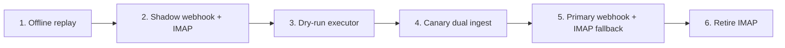

# Shadow, canary and primary rollout

The safe path to production is staged. Webhook ingestion and executor dispatch
have separate modes: a signed delivery can be observed without creating a job,
and a queued job can be processed without external side effects.



## 1. Offline replay

Replay saved GitHub notification emails as `.eml` files or an mbox.

```bash
gab --db /tmp/github-agent-bridge-shadow.sqlite3 init-db
gab --db /tmp/github-agent-bridge-shadow.sqlite3 --policy ./policy.json replay ./fixtures/github-emails --verbose
gab --db /tmp/github-agent-bridge-shadow.sqlite3 jobs --limit 50
```

Guarantees:

- no GitHub reaction;
- no OpenClaw agent dispatch;
- no IMAP mutation.

## 2. Observe both inputs in shadow

Read live IMAP with an independent bridge DB cursor, but do **not** mark
messages seen:

```bash
gab --db ~/.local/state/github-agent-bridge-shadow/bridge.sqlite3 read-imap-once \
  --email "$EMAIL" --password "$APP_PASSWORD" \
  --mailbox "${GITHUB_AGENT_BRIDGE_MAILBOX:-INBOX}"
```

For webhook delivery, configure an owner secret, keep
`GITHUB_AGENT_BRIDGE_WEBHOOK_MODE=shadow`, start
`github-agent-bridge-webhook.socket`, and route only
`/api/webhooks/github` to `127.0.0.1:8766`. Shadow mode verifies signatures and
persists delivery/coverage metadata but does not create jobs.

> `read-imap-once` only marks GitHub messages seen when `--mark-seen` is
> explicitly passed. Do not pass it in shadow mode. Webhook `shadow` is also
> observational; it is independent from executor `--mode shadow`.

## 3. Dry-run the executor

`--mode dry-run` claims jobs and renders intended side effects as successful
without executing external calls.

```bash
gab --db ~/.local/state/github-agent-bridge-shadow/bridge.sqlite3 \
  --policy ./policy.json run --mode dry-run --once --workers 4
```

Use this to validate:

- policy decisions;
- routes;
- repository roles;
- generated prompts;
- queue transitions.

## 4. Canary dual ingestion

Use `enabledRepos` as the global transport-neutral scope and
`webhookCanaryRepos` as the narrower fail-closed webhook enqueue allowlist:

```json
{
  "trustedOrgs": ["your-org"],
  "enabledRepos": ["your-org/your-repo"],
  "webhookCanaryRepos": ["your-org/your-repo"]
}
```

Set `GITHUB_AGENT_BRIDGE_WEBHOOK_MODE=canary`, point
`GITHUB_AGENT_BRIDGE_WEBHOOK_POLICY` at that policy, and run the executor in
`live`. Keep the IMAP reader enabled. When both transports can prove the same
canonical event identity, the first receipt creates the job and the second is
recorded as a duplicate of it.

Inspect webhook summary, exceptions and deliveries in the administrator
dashboard. Do not widen the canary while there are unexplained actionable
IMAP-only events, split jobs, or action/intent mismatches.

## 5. Primary webhook with IMAP fallback

After a complete clean canary window, set both:

```text
GITHUB_AGENT_BRIDGE_WEBHOOK_MODE=primary
GITHUB_AGENT_BRIDGE_WEBHOOK_PRIMARY_ACK=true
```

`primary` fails closed without the explicit acknowledgement and policy path.
It stops applying the narrower `webhookCanaryRepos` list, but the global
`enabledRepos`, trust, action and routing policy still apply.

Keep the IMAP reader active during a second stable observation window. Primary
changes which source is expected to win; it does not remove the idempotency or
fallback path.

## 6. Retire the IMAP fallback

Disable `github-agent-bridge-reader.timer` only after the primary window has no
unexplained actionable IMAP-only events or cross-source mismatches and the
operator has tested rollback. Remove IMAP-only code and credentials later in a
separate cleanup; do not combine that cleanup with the cutover.

The detailed identity model, coverage endpoints and GitHub hook setup live in
[`ingestion.md`](ingestion.md). The production migration is tracked in
[#299](https://github.com/gisce/github-agent-bridge/issues/299).

## Rollback

Return `GITHUB_AGENT_BRIDGE_WEBHOOK_MODE` to `shadow`, keep or re-enable the
IMAP reader timer, and inspect the webhook exception queue before retrying.
The durable bridge DB remains inspectable; do not replay historical deliveries
blindly because IMAP may already have processed them.
